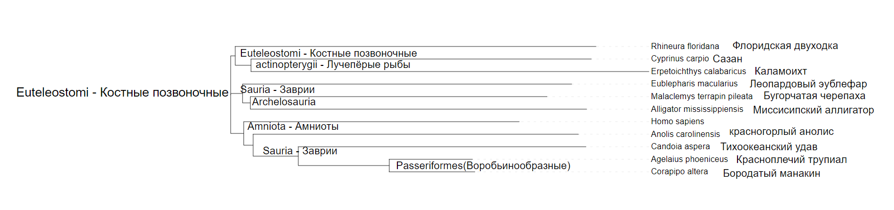

# Тема: Изучение представленности генов в таксонах
## Разминка
Какой ближайший таксон объединяет:

1. человека и мышь - Euarchontoglires
2. человека и бабочку - Nephrozoa
3. человека и дрожжи - Opisthokonta
4. человека и капусту - Eukaryota

Какой из организмов является ближайшим к человеку, а какой самым удаленным от человека:

* Дизентерийная амеба - ближайшая

* Ламинария сахаристая - самая удаленная

## Основное задание
### 1. Человеческий ген: [VIM vimentin](https://www.ncbi.nlm.nih.gov/gene/7431)
### 3. Гомологичные гены в других видах:

1) Malaclemys terrapin pileata vimentin (VIM) (per. ident. = 81.63%)

2) Candoia aspera vimentin (VIM) (per. ident. = 84.11%)

3) Anolis carolinensis vimentin (vim) (per. ident. = 83.26%)

4) Rhineura floridana vimentin (VIM) (per. ident. = 82.64%)

5) Agelaius phoeniceus vimentin (VIM) (per. ident. = 82.13%)

6) Corapipo altera vimentin (VIM) (per. ident. = 81.89%)

7) Alligator mississippiensis vimentin (VIM) (per. ident. = 81.81%)

8) Eublepharis macularius vimentin (VIM) (per. ident. = 84.76%)

9) Erpetoichthys calabaricus vimentin (vim) (per. ident. = 80.35%)

10) Cyprinus carpio vimentin (vim) (per. ident. = 77.89%)

# 4. Множественное выравнивание
Для получения выравнивания я использовала инструмент [MUSCLE](https://www.ebi.ac.uk/jdispatcher/msa/muscle)

[Результат](muscle-I20240501-142957-0042-64108344-p1m.aln-clustalw)

# 5. Анализ консервативных участков
По моим наблюдениям большинство консервативных участков находятся ближе к началу и концу. Мне кажется так получилось, потому что я выбрала виды мало гомологичные к человеку.

# 6. Ближайший таксон
MUSCLE также мне выдал Филогенетическое древо, на котором я отметила таксоны, так получилось, что заврии немного разделились

В итоге Ближайший таксон, объединяющий виды стал Euteleostomi - Костные позвоночные

Костные позвоночные - клада челюстноротых позвоночных, включающая костных рыб и четвероногих.