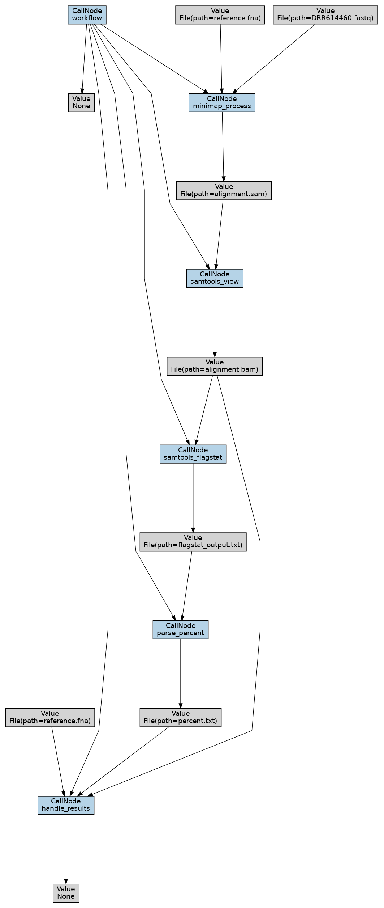

# bioinformatics-2
1. E. Coli DRR614460 : https://www.ncbi.nlm.nih.gov/sra/?term=DRR614460

2. Индексирование референсного генома с помощью minimap2
```bash
minimap2 -d reference.mmi reference.fna
```

3. Результат команды samtools flagstat 
https://github.com/nosikmy/bioinformatics/blob/main/HW_4/flagstat_output.txt#L1-L16

4.  Скрипт разбора результатов samtools flagstat для получения % картированных ридов
https://github.com/nosikmy/bioinformatics/blob/main/HW_4/script.sh#L1-L12

Запуск
```bash
bash script.sh
# not OK
```
6. Установка фреймворка redun
```bash
pip install redun
pip install redun[viz]
```
7. Тестовый код из документации к пайплайну
https://github.com/nosikmy/bioinformatics/blob/main/HW_4/hello_word.py#L1-L20

8. Запуск
```bash
redun run hello_word.py main
# Hello World!
```

10. Код пайплайна “оценки качества картирования” на фреймворке
https://github.com/nosikmy/bioinformatics/blob/main/HW_4/main.py#L1-L67


11. Результат работы пайплайна:
```bash
redun run main.py workflow
[redun] redun :: version 0.22.0
[redun] config dir: /home/gg/bioinformatics/HW_4/.redun
[redun] Start Execution c3d14ca9-2e63-42c7-b045-79af8ecb032f:  redun run main.py workflow
[redun] Tasks will require namespace soon. Either set namespace in the `@task` decorator or with the module-level variable `redun_namespace`.
tasks needing namespace: main.py:get_fastq, main.py:minimap_process, main.py:samtools_view, main.py:samtools_flagstat, main.py:parse_percent, main.py:handle_results, main.py:workflow
[redun] Cached Job 069594ef:  workflow() (eval_hash=eed12565, call_hash=None)
[redun] Cached Job a8139b06:  minimap_process(fastq=File(path=DRR614460.fastq, hash=3a47673d), reference=File(path=reference.fna, hash=285f35b8)) (eval_hash=f08ba6eb, call_hash=None)
[redun] Miss   Job d02c4474:  Cached result is no longer valid (result=File(path=alignment.bam, hash=7c32695b), eval_hash=5fa51ac7).
[redun] Run    Job d02c4474:  samtools_view(sam=File(path=alignment.sam, hash=fd3e0639)) on default
[redun] 
[redun] | JOB STATUS 2024/11/11 23:11:19
[redun] | TASK              PENDING RUNNING  FAILED  CACHED    DONE   TOTAL
[redun] | 
[redun] | ALL                     3       2       0       1       0       6
[redun] | handle_results          1       0       0       0       0       1
[redun] | minimap_process         0       0       0       1       0       1
[redun] | parse_percent           1       0       0       0       0       1
[redun] | samtools_flagstat       1       0       0       0       0       1
[redun] | samtools_view           0       1       0       0       0       1
[redun] | workflow                0       1       0       0       0       1
[redun] 
[redun] 
[redun] Run    Job 212b3b7a:  samtools_flagstat(bam=File(path=alignment.bam, hash=b07ee0a0)) on default
[redun] Run    Job 2a297400:  parse_percent(stats=File(path=flagstat_output.txt, hash=5c34c43f)) on default
[redun] Run    Job c57eb3c3:  handle_results(percent_txt=File(path=percent.txt, hash=3c832080), bam=File(path=alignment.bam, hash=b07ee0a0), reference=File(path=reference.fna, hash=285f35b8)) on default
not OK
[redun] 
[redun] | JOB STATUS 2024/11/11 23:11:37
[redun] | TASK              PENDING RUNNING  FAILED  CACHED    DONE   TOTAL
[redun] | 
[redun] | ALL                     0       0       0       2       4       6
[redun] | handle_results          0       0       0       0       1       1
[redun] | minimap_process         0       0       0       1       0       1
[redun] | parse_percent           0       0       0       0       1       1
[redun] | samtools_flagstat       0       0       0       0       1       1
[redun] | samtools_view           0       0       0       0       1       1
[redun] | workflow                0       0       0       1       0       1
[redun] 
[redun] 
[redun] Execution duration: 38.69 seconds
```

12. Получение графической визуализации
c3d14ca9-2e63-42c7-b045-79af8ecb032f - Execution ID, мы его получили в прошлом пункте
```bash
redun viz c3d14ca9-2e63-42c7-b045-79af8ecb032f --output DAG
```


В отличии от блок-схемы в моем графике есть стрелочки от начала ко всем шагам, но возможно это моя ошибка. В полученной схеме есть информация о получаемых файлах на каждом шаге. Так как процент < 90 в итоге вывод - None