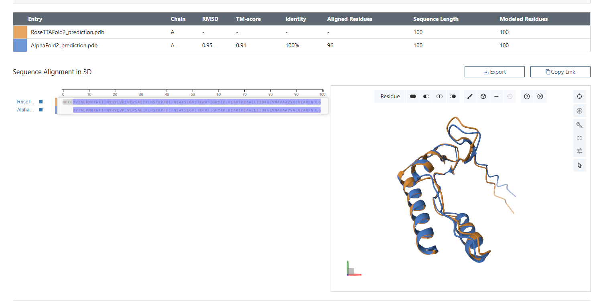
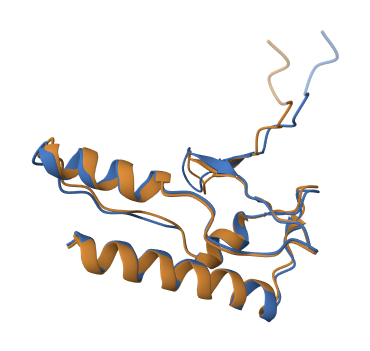

## Последовательность, название программ-предсказателей и программы-выравнивателя

**Последовательность:** MDKGDVTALPMKKWFTTNYHYLVPEVEPSAEIKLNSTKPFDEFNEAKSLGVETKPVFIGPYTFLKLARTPEAAELEIDKGLVNAVAAVYAEVLARFNDLG

**Инструменты фолдинга белков:**

- [RoseTTAFold2](https://colab.research.google.com/github/sokrypton/ColabFold/blob/main/RoseTTAFold2.ipynb)
- [AlphaFold2](https://colab.research.google.com/github/sokrypton/ColabFold/blob/main/AlphaFold2.ipynb)

**Инструмент парного выравнивания:** [jCE-CP (в списке Alignment Method)](https://www.rcsb.org/alignment)

## Полученные ноутбуки с предсказанной структурой

[RoseTTAFold2.ipynb](https://github.com/nosikmy/bioinformatics/blob/main/HW_5/RoseTTAFold2/RoseTTAFold2.ipynb)

[AlphaFold2.ipynb](https://github.com/nosikmy/bioinformatics/blob/main/HW_5/AlphaFold2/AlphaFold2.ipynb)

## Полученные предсказания: 

[RoseTTAFold2_prediction.pdb](https://github.com/PeachMood/bioinformatics/blob/main/HW_5/RoseTTAFold2/RoseTTAFold2_prediction.pdb)

[AlphaFold2_prediction.pdb](https://github.com/PeachMood/bioinformatics/blob/main/HW_5/AlphaFold2/AlphaFold2_prediction.pdb)

## Полная выдача программы выравнивания:
[Alignment(jCE-CP)](https://github.com/PeachMood/bioinformatics/blob/main/HW_5/Alignment(jCE-CP))

Также данный инструмент делает изображение выравнивания с расскраской двумя цветами

## Изображения выравнивания:
### Оранжевый - RoseTTAFold2
### Синий - AlphaFold2

.png>)

## Краткие выводы о совпадении полученных предсказаний

Уже видно было, что предсказания получились очень похожие на этапе их получения, когда можно было получить визуализацию в ноутбуках. Выравнивание также показало, что ппредсказания почти идентичности. 

Так как две разные модели дали очень близкий результат, можно сделать вывод что эти предсказания очень точны.

