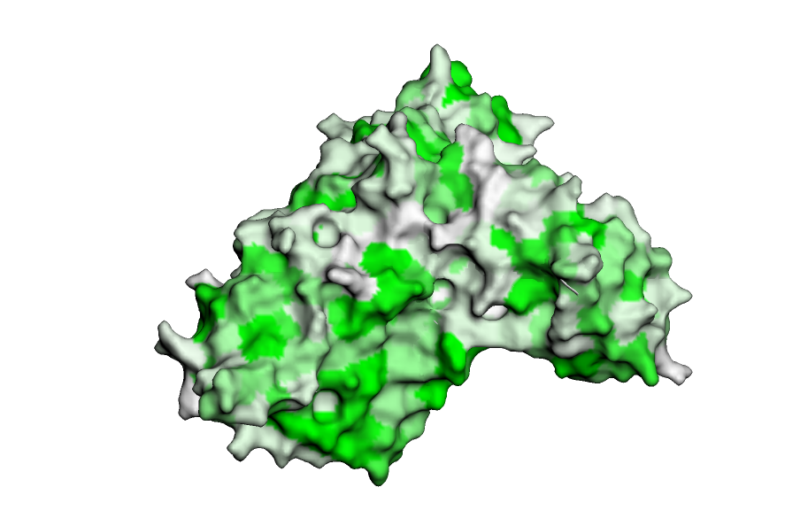
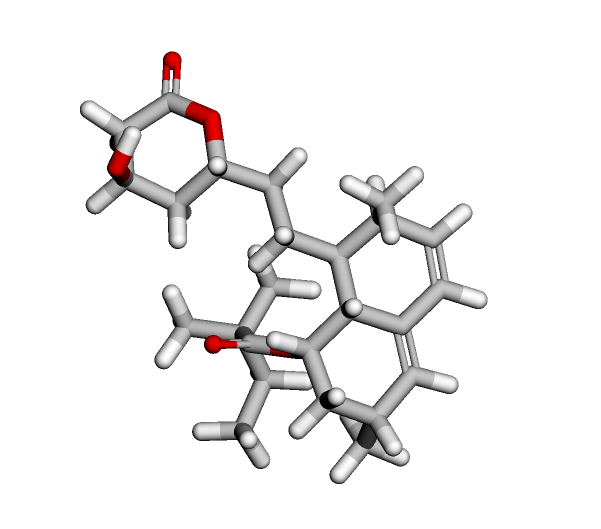
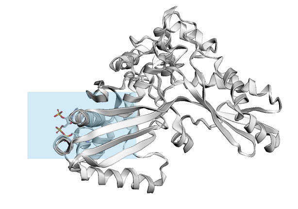
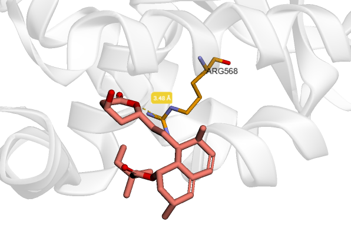

# 1) Информация о препарате Симвастатин
**Действующее вещество:** Симвастатин (Simvastatin)

**Область применения:** Используется для лечения пациентов с повышенным уровнем холестерина в крови, а также для предотвращения сердечно-сосудистых заболеваний, таких как инфаркт миокарда и инсульт

**Молекулярный механизм действия:** Подавляет активность фермента ГМГ-КоA редуктазы. Этот фермент играет важную роль в процессе образования холестерина в организме. Подавляя активность этого фермента, симвастатин помогает снизить уровень холестерина в крови
# 2) [Ноутбук с докингом](Notebook.ipynb)
# 3) [Результат докинга](Docking\1DQA\DOCKING\SIM)
# 4)  Изображения
### a\. Трехмерная структура подготовленного таргета

### b\. Трехмерная структура исходного лиганда

### c\. Полученный бокс

### d\. Полученный докинг
